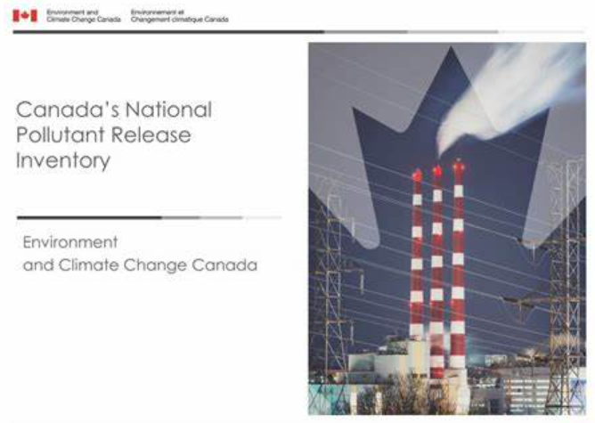

# NPRI Time Series Regression Analysis

This project analyzes the National Pollutant Release Inventory (NPRI) dataset to forecast pollutant release trends across industries in Canada. The primary objective is to identify industries with the highest projected increases and decreases in pollutant emissions over the next five years.

## Project Goals:

1. **Refine the Time Series Dataset**: Cleaning and restructuring the dataset for forecasting.
2. **Develop Regression Models**: Implementing regression techniques to predict future pollutant release levels.
3. **Apply Advanced Feature Engineering**: Creating new features (lag variables, trend indicators) to enhance model accuracy.
4. **Evaluate and Interpret Models**: Assessing model performance using metrics (RMSE, R², MAE) and interpreting results.
5. **Document the Process**: Presenting the work in a well-structured Jupyter Notebook with visualizations.

## Data Preparation and Feature Engineering:

- **Media-Based Aggregation**: Aggregate pollutant releases into three categories: air, land, and water.
- **Substance-Specific Analysis**: Create individual datasets for each substance to capture unique temporal patterns and industry usage.
- **Data Persistence**: Save each substance dataset as a separate file in Parquet format.
- **Handling Missing Data**: Identify and address missing years in substance reporting.
- **Lag Feature Creation**: Construct lag features (e.g., past 7 years of data) for each target variable.

## Key Findings:

- Many substances in the NPRI dataset do not have complete data for all reporting years.
- Only a subset of substances have sufficient data quality and consistency for reliable time series modeling.
- A combination of statistical filtering and domain expertise was used to select the most suitable substances for analysis.

## Environmental Relevance:

This project focuses on a real-world issue with implications for environmental sustainability and policy-making. By leveraging time series regression models, we aim to deliver accurate predictions and support data-driven environmental decision-making.

## Future Work:

- Explore and implement different time series regression models (ARIMA, Prophet, etc.) for forecasting.
- Fine-tune model hyperparameters using cross-validation techniques.
- Analyze industry-specific trends and variations.
- Investigate the environmental and economic impact of the predicted emission changes.
- Develop interactive visualizations and dashboards for disseminating results to stakeholders.

## Project Team:

- Angela Lekivetz
- Alma Soria
- Crystal Blackburn
- Michaela Goud

## Data Source:

National Pollutant Release Inventory (NPRI) - [https://www.canada.ca/en/services/environment/pollution-waste-management/national-pollutant-release-inventory.html](https://www.canada.ca/en/services/environment/pollution-waste-management/national-pollutant-release-inventory.html)
